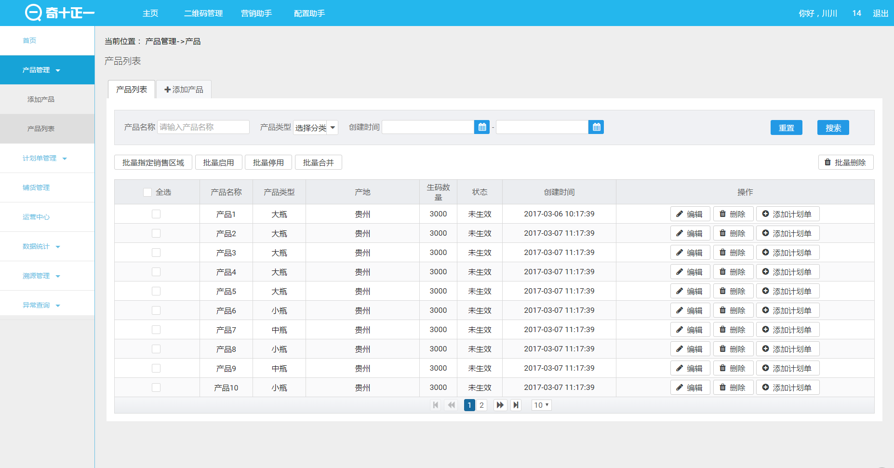

#Backend-Admin

 这是奇十正一的后台管理界面，纯前端，没有任何后端代码。整体基于Angular2和primeNG2.0.0。 

# 用法

用git克隆本项目，从命令行进入进入项目根目录，依次执行以下命令：

	1.解压缩node_modules.zip到当前目录
	2.执行npm start命令启动
	3.打开你的浏览器，访问http://localhost:4200/ 查看演示效果

如果你想让加载的包更小，请使用以下方式启动angular-cli内置的轻量级http server

	ng serve --prod --aot
