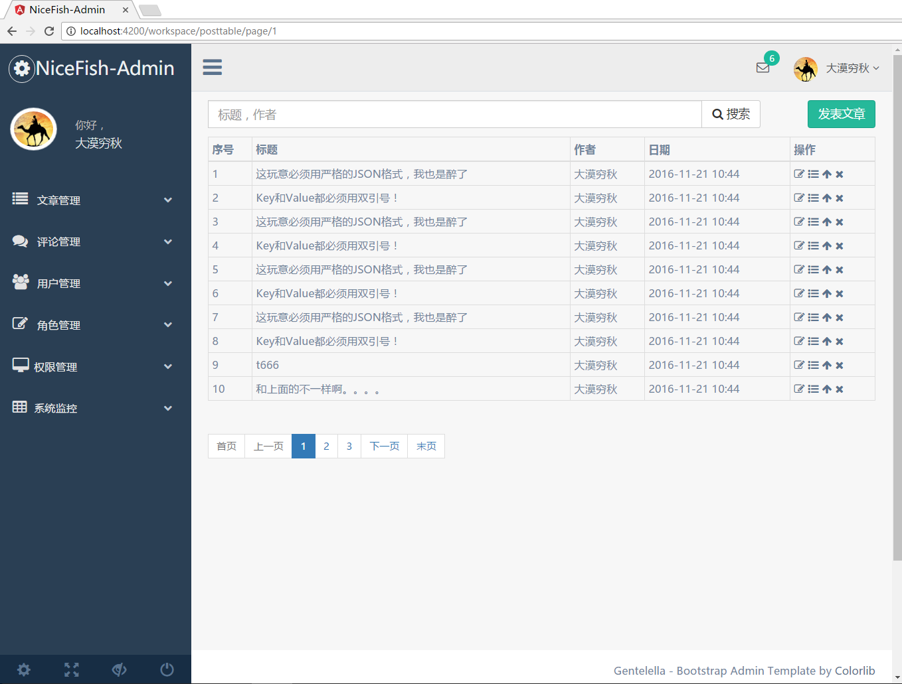

#NiceFish-Admin

 这是NiceFish的后台管理界面，纯前端，没有任何后端代码。整体基于Angular2和Bootstrap3.3.7，用来示范Angular2在后台管理系统里面的典型使用方法。 
 NiceFish的前端代码在这里：http://git.oschina.net/mumu-osc/NiceFish
 NiceFish的后端Java代码在这里：http://git.oschina.net/mumu-osc/NiceFish-BackEnd
 欢迎一起来玩儿！

# 用法

用git克隆本项目，从命令行进入进入项目根目录，依次执行以下命令：

	npm i -g cnpm
	cnpm i -g @angular/cli
	cnpm install
	ng serve

如果之前装过angular-cli需要先卸载：npm uninstall -g angular-cli
如果之前装过@angular/cli需要先卸载：npm uninstall -g @angular/cli
如果你之前已经尝试安装过node模块，请把NiceFish根目录下的node_moduels目录删掉
然后依次执行以下命令：

	npm cache clean
	npm i -g cnpm
	cnpm i -g @angular/cli
	cnpm install
	ng serve

打开你的浏览器，访问http://localhost:4200/

如果你想让加载的包更小，请使用以下方式启动angular-cli内置的轻量级http server

	ng serve --prod --aot

如果你需要把项目发布到其它类型的Server上，例如Tomcat，需要对Server进行一些简单的配置才能支持HTML5下的PushState路由模式，我在这篇文章里面有详细的介绍https://my.oschina.net/mumu/blog/830696。

【注意】如果你发现ng serve起不来，或者起来有报错，请把NiceFish根目录下的node_modules目录删掉，然后重新执行cnpm install，全局的@angular/cli也需要重装。

## 开源许可证
 MIT

 你可以随意使用此项目，无需通知我，因为我可能很忙没空搭理你。

## 关于我
我是大漠穷秋，目前是Google Angular项目组在中国的开发者PM，负责Angular的推广工作，我会在各种渠道经常发布一些与Angular相关的技术文章，希望能给大家带来一点点帮助，请点这里：https://my.oschina.net/mumu/blog  。

如果您的企业或者组织需要Angular方面的技术支持，请填写这份申请单：https://gdgdocs.org/forms/d/e/1FAIpQLSfKA15nS0md58fR__tAV6gSEIPsVsLksT9knOgObq9IbVPuQg/viewform

【注意】我每天都会收到大量的求助消息，真的有点忙，所以请准确描述您的问题，最好能加上一些截图，非常感谢！

## 在线交流QQ群

<a target="_blank" href="//shang.qq.com/wpa/qunwpa?idkey=8db5ed802cbddbf6432d7ba7dc4f2a316be020442491eb41cbfb1a12434e8cc7" class="list-group-item"><i class="fa fa-qq" aria-hidden="true"></i> Angular 1区:286047042（满）</a>
<a target="_blank" href="//shang.qq.com/wpa/qunwpa?idkey=cbfcd79e7e90939b0e2c519f475fac4792985ce2abc5ad45ec5e06ffcfe944dd" class="list-group-item"><i class="fa fa-qq" aria-hidden="true"></i> Angular 2区:139357161（满）</a>
<a target="_blank" href="//shang.qq.com/wpa/qunwpa?idkey=639229c8b6ad0c3a9a8f381dddf5d7785780b20d8c37eb25c91ac73ea7d37a5f" class="list-group-item"><i class="fa fa-qq" aria-hidden="true"></i> Angular 3区:473129930（将满）</a>
<a target="_blank" href="//shang.qq.com/wpa/qunwpa?idkey=12add102af3f67910bdc0de753dee10ebada08ab485af7e38f4dfa0ee27476f7" class="list-group-item"><i class="fa fa-qq" aria-hidden="true"></i> Angular 4区:483016484（空）</a>
